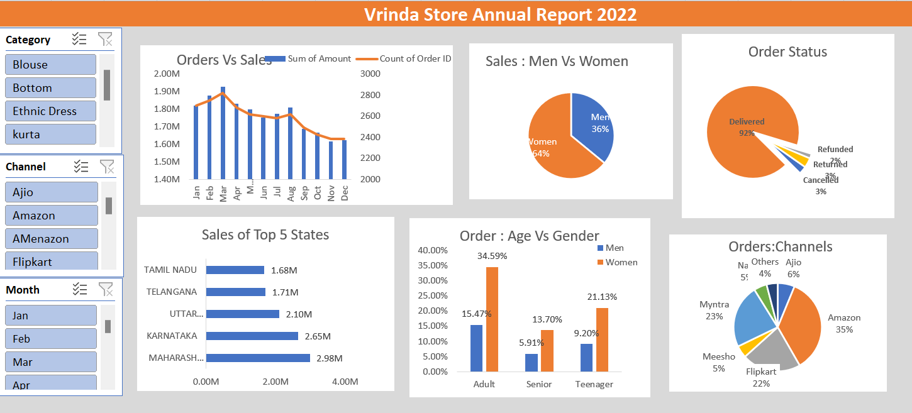

# Vrinda Store Annual Report 2022 📊
Overview
This repository contains an interactive Power BI/Excel dashboard for Vrinda Store's annual sales and order performance in 2022. The dashboard provides insights into sales trends, customer demographics, order distribution, and top-performing sales channels.

Key Insights
1️⃣ Orders vs Sales Trends
Sales peaked in February and March, with a decline towards the year-end.
Both sales revenue and order count show a seasonal trend.
2️⃣ Sales Distribution: Men vs. Women
Women contributed 64% of total sales, while men accounted for 36%.
Indicates that female customers are the primary buyers at Vrinda Store.
3️⃣ Order Status Performance
92% of orders were successfully delivered, ensuring smooth fulfillment.
3% canceled, 2% returned, and 2% refunded, reflecting a low order failure rate.
4️⃣ Top 5 States by Sales
Maharashtra leads with 2.98M in sales, followed by Karnataka (2.65M) and Uttar Pradesh (2.10M).
Tamil Nadu (1.68M) and Telangana (1.71M) also contribute significantly.
5️⃣ Orders: Age vs. Gender Breakdown
Adults (34.59% women, 15.47% men) make the most purchases.
Teenagers (21.13% women, 9.20% men) also engage significantly.
Seniors contribute the least, indicating potential market expansion opportunities.
6️⃣ Orders by Sales Channels
Amazon leads with 35% of total sales, followed by Flipkart (22%) and Myntra (23%).
Ajio (6%), Meesho (5%), and Others (4%) contribute smaller shares

Dashboard Preview 🖥️

